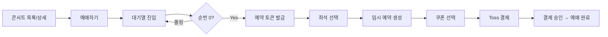

https://github.com/plere/ticketing 에 대한 웹 화면

예매 flow

```mermaid
flowchart LR
    A[콘서트 목록/상세] --> B[예매하기]
    B --> C[대기열 진입]
    C --> D{순번 0?}
    D -->|폴링| C
    D -->|Yes| E[예약 토큰 발급]
    E --> F[좌석 선택]
    F --> G[임시 예약 생성]
    G --> H[쿠폰 선택]
    H --> I[Toss 결제]
    I --> J[결제 승인 → 예매 완료]
```
